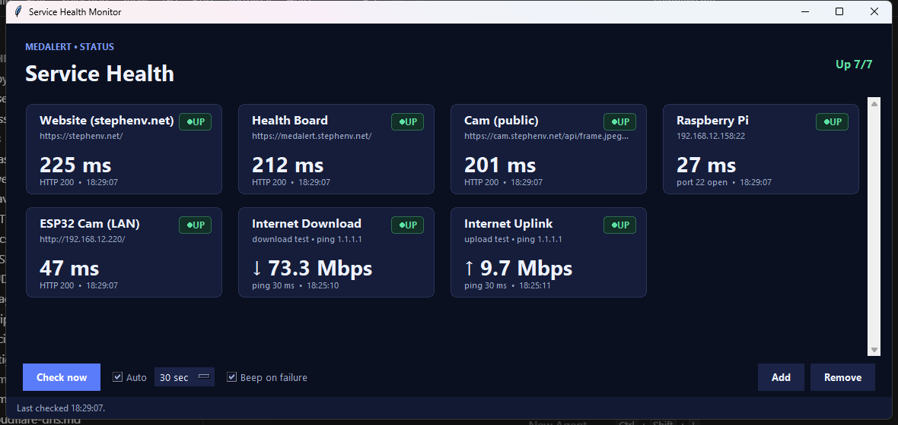

# Service Health Monitor

[](https://github.com/stephenvowell/service-monitor/actions/workflows/ci.yml)
[](LICENSE)
[](https://www.python.org/)
[](#)
[](#)

A tiny, **dependency-free** desktop dashboard that shows a green/red status for
the things you care about — websites, APIs, a Raspberry Pi, an ESP32, even your
own internet speed — and beeps when something goes down. One file, plain
Tkinter, no external packages.



*The dashboard at a glance: each service is a card with a colored status pill
(green UP / amber WARN / red DOWN), a headline value (response time, or Mbps
for the speed cards), and a footer with detail + last-checked time. The header
shows an "Up N/N" summary that turns amber or red if anything degrades.*

## Features

- **Live status cards** with response times, auto-refreshing on a timer.
- **Five check types** — HTTP, TCP, ping, plus internet **download** and
  **upload** speed (via Cloudflare) with ping latency.
- **Beep on failure** — audible alert only when a service *transitions* to DOWN.
- **Add / remove services** from the UI; everything persists to a JSON file.
- **Bandwidth-aware** — speed tests are rate-limited so they don't hog data.
- **Zero runtime dependencies** — standard library + Tkinter only.
- **Standalone build** — ship a single `.exe` via PyInstaller.

## Quick start

```bash
python service_monitor.py
```

Requires **Python 3.8+** (uses the standard library + Tkinter, which ships with
the python.org Windows installer and is available as `python3-tk` on Linux).

## Check types

| Type      | How it decides "up"                                              |
|-----------|-----------------------------------------------------------------|
| `http`    | GETs the URL. **UP** if status ≤ `expect_max`, **WARN** if < 500, else **DOWN** |
| `tcp`     | Opens a socket to `host:port`. **UP** if it connects            |
| `ping`    | System `ping`. **UP** if the host replies (shows round-trip ms) |
| `netperf` | Measures this PC's **upload speed** (via Cloudflare) + **ping**. Big value = Mbps ↑ |
| `netdown` | Measures this PC's **download speed** (via Cloudflare) + **ping**. Big value = Mbps ↓ |

### The speed cards (Internet Download / Uplink)

These transfer a small chunk to/from Cloudflare's public speed-test endpoint
and show throughput plus ping latency:

- **Download** (`netdown`) — downloads 10 MB, shows `↓ Mbps`
- **Upload** (`netperf`) — uploads 2 MB, shows `↑ Mbps`

Because they use bandwidth, they're **rate-limited**: each runs at most once
every `min_interval` seconds (default 300 = 5 min) on auto-refresh, but always
runs when you press **Check now**. At the defaults that's ~12 MB every 5
minutes combined. The other cards keep updating on your normal interval.

## Using it

- **Check now** — run all checks immediately.
- **Auto** + interval — re-check every 15s / 30s / 1m / 5m.
- **Beep on failure** — plays a sound when a service *transitions* to DOWN.
- **Add… / Remove** — manage services from the UI (click a card to select it).

Settings and the service list are saved to `service_monitor_config.json` next
to the app (or next to the `.exe` when built). You can also edit it by hand:

```json
{
  "settings": { "interval_label": "30 sec", "auto_refresh": true, "sound_on_failure": true },
  "services": [
    { "name": "My Site", "type": "http", "target": "https://example.com/", "expect_max": 399 },
    { "name": "Home Server", "type": "tcp", "target": "192.168.1.10", "port": 22 },
    { "name": "Internet Download", "type": "netdown", "target": "1.1.1.1", "min_interval": 300 }
  ]
}
```

## Build a standalone .exe

```powershell
./build_exe.ps1
```

Produces `dist/ServiceHealthMonitor.exe`. The config file is written next to the
exe, so your services persist between runs. (CI also builds this on every push
and uploads it as an artifact.)

## Development

```bash
pip install -r requirements-dev.txt
pytest -q
```

The network checks are thin wrappers around the standard library; the test
suite covers the pure logic (status classification, throughput math, config
round-tripping, the checker registry) so it runs fast and offline.

## Project layout

```
service-monitor/
├─ service_monitor.py        # the whole app
├─ build_exe.ps1             # PyInstaller build script
├─ requirements-dev.txt      # dev-only deps (pytest, pyinstaller)
├─ tests/
│  └─ test_service_monitor.py
├─ docs/
│  └─ screenshot.png
├─ .github/workflows/ci.yml  # test (Linux) + build exe (Windows)
├─ CHANGELOG.md
└─ LICENSE
```

## License

[MIT](LICENSE) © Stephen Vowell
